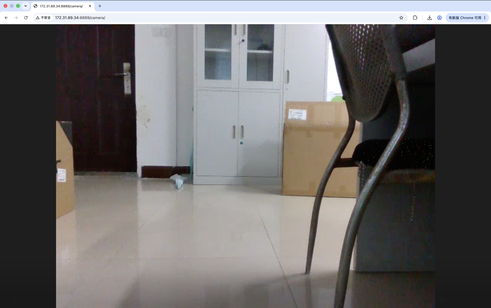

# 推流效果图


# 摄像头列表

| 设备名称        | 备注        |
| ----------- | --------- |
| /dev/video4 | 头顶usb深度相机 |
| /dev/video2 | 红外        |
| /dev/video0 | 深度        |

# 安装相关依赖和软件包
## 安装ffmpeg
查看github教程
## 安装mediaMtx
### 安装wget
``` bash
sudo apt update

sudo apt install -y wget tar
```
### 下载mediaMtx
进入 `/opt`

```
cd /opt
```

下载最新版（下面以 amd64 举例）：

```
sudo wget https://github.com/bluenviron/mediamtx/releases/latest/download/mediamtx_linux_amd64.tar.gz
```

如果是 ARM：

```
sudo wget https://github.com/bluenviron/mediamtx/releases/latest/download/mediamtx_linux_arm64.tar.gz
```
到这一步，你会发现**根本下载不了**因为狗连接不上github，怎么办呢，移步到这里: https://github.com/bluenviron/mediamtx/releases
版本：mediamtx_v1.19.3_linux_arm64.tar.gz
从自己电脑上下载后拖动到nomachine里面，拷贝到/opt文件夹下（使用sudo cp命令）


```
sudo tar -zxvf mediamtx_v1.19.3_linux_arm64.tar.gz
```

进入目录：

```
ls
```

应该看到：

```
mediamtx
mediamtx.yml
```

### 安装MediaMtx到系统目录
创建目录：

```
sudo mkdir -p /usr/local/bin/mediamtx
sudo mkdir -p /usr/local/etc/mediamtx
```

复制：

```
sudo cp mediamtx /usr/local/bin/mediamtx/

sudo cp mediamtx.yml /usr/local/etc/mediamtx/
```

测试：

```
/usr/local/bin/mediamtx/mediamtx
```

正常应该看到：

```
INF MediaMTX
INF configuration loaded
INF [RTSP] listener opened on :8554
INF [WebRTC] listener opened on :8889
```

Ctrl+C退出。

### 配置MediaMtx
清空旧的配置文件
```bash
sudo truncate -s 0 /opt/mediamtx.yml
```

写入新的配置文件
```bash
sudo nano /opt/mediamtx.yml
```

yml里面应该完全按照如下配置写入：
```text
################################
# 全局配置
################################

logLevel: info


################################
# RTSP
################################

rtsp: yes
rtspAddress: :8554


################################
# WebRTC
################################

webrtc: yes
webrtcAddress: :8889

# 允许网页跨域
webrtcAllowOrigins:
  - "*"


################################
# HTTP HLS
################################

hls: yes
hlsAddress: :8888


################################
# API
################################
api: yes
apiAddress: :9997


################################
# 摄像头流
################################

paths:

  camera:
    source: publisher


```

# 安装摄像头信息查看实用程序
```bash
sudo apt install v4l-utils
```


# 推流
## 查看摄像头列表
```bash
v4l2-ctl --list-devices
```
输出
```bash
unitree@ubuntu:~$ v4l2-ctl --list-devices
NVIDIA Tegra Video Input Device (platform:tegra-camrtc-ca):
	/dev/media0

Intel(R) RealSense(TM) Depth Ca (usb-3610000.xhci-1):
	/dev/video0
	/dev/video1
	/dev/video2
	/dev/video3
	/dev/video4
	/dev/video5
	/dev/media1
	/dev/media2

```

## 查看摄像头支持的参数
```bash
v4l2-ctl --list-formats-ext -d /dev/video4
```

输出
```bash
unitree@ubuntu:~$ v4l2-ctl --list-formats-ext -d /dev/video4
ioctl: VIDIOC_ENUM_FMT
	Type: Video Capture

	[0]: 'YUYV' (YUYV 4:2:2)
		Size: Discrete 320x180
			Interval: Discrete 0.017s (60.000 fps)
			Interval: Discrete 0.033s (30.000 fps)
			Interval: Discrete 0.167s (6.000 fps)
		Size: Discrete 320x240
			Interval: Discrete 0.017s (60.000 fps)
			Interval: Discrete 0.033s (30.000 fps)
			Interval: Discrete 0.167s (6.000 fps)
		Size: Discrete 424x240
			Interval: Discrete 0.017s (60.000 fps)
			Interval: Discrete 0.033s (30.000 fps)
			Interval: Discrete 0.067s (15.000 fps)
			Interval: Discrete 0.167s (6.000 fps)
		Size: Discrete 640x360
			Interval: Discrete 0.017s (60.000 fps)
			Interval: Discrete 0.033s (30.000 fps)
			Interval: Discrete 0.067s (15.000 fps)
			Interval: Discrete 0.167s (6.000 fps)
		Size: Discrete 640x480
			Interval: Discrete 0.017s (60.000 fps)
			Interval: Discrete 0.033s (30.000 fps)
			Interval: Discrete 0.067s (15.000 fps)
			Interval: Discrete 0.167s (6.000 fps)
		Size: Discrete 848x480
			Interval: Discrete 0.017s (60.000 fps)
			Interval: Discrete 0.033s (30.000 fps)
			Interval: Discrete 0.067s (15.000 fps)
			Interval: Discrete 0.167s (6.000 fps)
		Size: Discrete 960x540
			Interval: Discrete 0.017s (60.000 fps)
			Interval: Discrete 0.033s (30.000 fps)
			Interval: Discrete 0.067s (15.000 fps)
			Interval: Discrete 0.167s (6.000 fps)
		Size: Discrete 1280x720
			Interval: Discrete 0.033s (30.000 fps)
			Interval: Discrete 0.067s (15.000 fps)
			Interval: Discrete 0.167s (6.000 fps)
		Size: Discrete 1920x1080
			Interval: Discrete 0.033s (30.000 fps)
			Interval: Discrete 0.067s (15.000 fps)
			Interval: Discrete 0.167s (6.000 fps)
	[1]: 'BYR2' (16-bit Bayer BGBG/GRGR (Exp.))
		Size: Discrete 1920x1080
			Interval: Discrete 0.033s (30.000 fps)

```


## 正式推流
### 打开推流服务器
使用一个termial输入以下命令打开
```bash
/usr/local/bin/mediamtx/mediamtx
```
### 打开ffmpeg把usb转换成视频流
使用另一个termial输入：
```bash
ffmpeg \
-f v4l2 \
-input_format yuyv422 \
-video_size 640x480 \
-framerate 30 \
-i /dev/video4 \
-c:v libx264 \
-preset ultrafast \
-tune zerolatency \
-profile:v baseline \
-pix_fmt yuv420p \
-f rtsp \
rtsp://127.0.0.1:8554/camera

```

## 视频流地址
Ubuntu_IP: 172.31.89.34
http://Ubuntu_IP:8889/camera
rtsp://Ubuntu_IP:8554/camera

http://172.31.89.34:8889/camera

